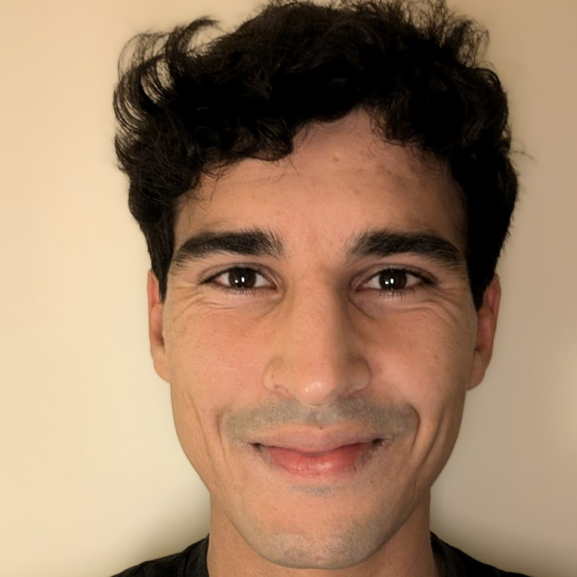

    

# Adam Remaki
[:simple-gmail:{ .mail }](mailto:adam.remaki@etu.sorbonne-universite.fr) [:fontawesome-brands-github:{ .github }](https://github.com/Aremaki) [:fontawesome-brands-linkedin:{ .linkedin }](https://www.linkedin.com/in/adam-remaki-402aaa174) [:simple-googlescholar:{ .scholar }](https://scholar.google.com/citations?user=nELf6ngAAAAJ&hl=en) [:simple-orcid:{ .orcid }](https://orcid.org/0000-0002-8902-8207)

I’m Adam Remaki, a **PhD student** in **biomedical NLP** at **Sorbonne Université** since 2023, under the supervision of Xavier Tannier and Christel Gérardin. I hold a double degree in engineering from **CentraleSupélec** and an MSc in Applied Statistics from **Imperial College London**, completed in 2021.

Before my PhD, I worked as a **data scientist** at the Digital Services Department of **AP-HP (Greater Paris University Hospitals)**, where I contributed to the development of AI solutions for **Europe’s largest clinical data warehouse**, which holds records from over 11 million patients and supports hundreds of research projects.

My research focuses on biomedical information extraction from clinical notes, with the goal of improving the analysis and usability of **electronic health records**. I am committed to advancing public healthcare through the application of artificial intelligence. 

Explore my [**publications**](/publications), [**softwares**](/softwares), and [**teaching**](/teaching) on this site.
